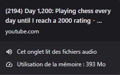

# Bop

**Bop** is a minimal Windows system-tray audio player that plays only the **audio track** of YouTube videos — it never downloads the video stream.

> Paste a YouTube URL, just listen to the sound. Nothing else.

---

## Goal

Most of the time spent "watching" a YouTube video in the background — while working, coding, or gaming — doesn't require **any picture on screen**. What you actually want is the sound: a podcast, a music session, a talk.

Yet a regular browser downloads and decodes the entire video stream even when the tab is in the background or minimized. Bop starts from a simple principle: **only fetch what is actually being consumed**, i.e. the audio.

This is technically possible because YouTube (like most streaming platforms) serves video as *adaptive streaming* (DASH): the video track and the audio track are two **separate** streams, reassembled client-side. Bop, via [`yt-dlp`](https://github.com/yt-dlp/yt-dlp), resolves only the URL of the best available audio stream and plays it directly with [NAudio](https://github.com/naudio/NAudio) — the video stream is never requested from the server.

## Why this choice actually matters

### 1. Bandwidth

This is the most direct and easiest gain to demonstrate. A video stream weighs an order of magnitude (sometimes two) more than an audio stream, for a simple reason: encoding a picture that changes 24 to 60 times per second costs vastly more data than encoding a sound wave.

**Methodology** — bitrates commonly observed on YouTube:

| Stream | Typical bitrate | Source |
|---|---|---|
| Audio (Opus, the `bestaudio` format yt-dlp picks) | ~128 kbit/s | itag 251, the most common one on music/speech videos |
| 1080p video (VP9/AVC) | ~4,000 to 8,000 kbit/s | varies with codec and image complexity |

**Worked example, for a 40-minute video in 1080p (average video bitrate used: 5,000 kbit/s)**:

| | Calculation | Result |
|---|---|---|
| Video stream only | 5,000 kbit/s × 2,400 s ÷ 8 | **≈ 1.5 GB** |
| Audio stream only | 128 kbit/s × 2,400 s ÷ 8 | **≈ 38 MB** |
| Reduction | 1 − (38 / 1500) | **≈ 97%** (the audio stream weighs ~2.5% of the video stream) |

These figures match the "1.5 GB video vs 30 MB audio" order of magnitude quoted for this type of video — **they're plausible and consistent with YouTube's real encoding bitrates**, but they remain estimates: the exact bitrate depends on resolution, codec, length, and content of each specific video.

**How to verify these numbers on a specific video** (rather than trusting a table):
```bash
# List all available formats with their approximate size
yt-dlp -F "VIDEO_URL"

# Size of the audio-only stream
yt-dlp -f bestaudio --print filesize_approx "VIDEO_URL"

# Size of the best video stream (audio included)
yt-dlp -f best --print filesize_approx "VIDEO_URL"
```
These commands give the real number for any video, which lets you include reproducible proof (a screenshot, or a generated table) instead of a single hard-to-verify figure.

> This comparison assumes the video is watched (or, in Bop's case, listened to) in full. A browser using adaptive streaming doesn't download the entire video at once, but the cumulative amount of data transferred over a full playthrough converges to *bitrate × duration* — and that cumulative amount is what matters on a data-capped or metered connection.

### 2. Machine resources

By skipping video decoding and rendering, **Bop** drastically reduces CPU and RAM consumption compared to playing the same audio in a web browser.

| YouTube (Web Browser) | Bop Player |
| :---: | :---: |
|  |  |
| *High RAM usage (Video decoding)* | *Minimal CPU, RAM & Disk usage -  (Audio stream only)* |

### 3. Targeted use case

Bop isn't trying to replace YouTube: it's a deliberate, acknowledged choice to serve **only** the "I need the sound, not the picture" use case (work, coding, gaming, background tasks). It isn't meant to become a general-purpose video player — see the [Roadmap](#roadmap) for where this is headed.

---

## Features

- **System-tray icon** with a context menu (light/dark theme automatically follows the Windows theme)
- **Play from clipboard**: copy a YouTube URL, click "Play copied URL"
- **Floating mini-player** in a Spotify-style mini-player fashion:
  - video thumbnail (sharp at rest, blurred with overlaid controls on hover)
  - play/pause, ±5s seek, next track
  - clickable/draggable progress bar and volume bar
  - freely draggable with the mouse, quick close button
- **Queue** (up to 6 items): add from clipboard while a track is playing, remove with a click, automatic playback of the next track when the current one ends
- **Media keyboard shortcut** (keyboard Play/Pause key, falling back to `Ctrl+F8` if the key is unavailable)
- **Launch at Windows startup** (toggleable from the menu)

## Technical architecture

| Component | Role |
|---|---|
| [YoutubeDLSharp](https://github.com/Bluegrams/YoutubeDLSharp) (wrapper around `yt-dlp.exe`) | Resolves metadata and the URL of the best available **audio-only** stream |
| `ffmpeg.exe` | Used by yt-dlp as support for certain stream resolutions |
| [NAudio](https://github.com/naudio/NAudio) (`WaveOutEvent` / `MediaFoundationReader`) | Plays the audio stream directly from the remote URL, with no file ever downloaded to disk |
| Windows Forms | UI (tray icon, GDI+-drawn mini-player) |

No step of the application downloads or stores the video file: only the audio stream's URL is resolved and played in streaming mode.

## Prerequisites

- Windows 10/11
- [.NET Desktop Runtime](https://dotnet.microsoft.com/) matching the version the project targets
- `yt-dlp.exe` and `ffmpeg.exe` placed **in the same folder as Bop's executable**:
  - `yt-dlp.exe`: [official yt-dlp repository](https://github.com/yt-dlp/yt-dlp/releases)
  - `ffmpeg.exe`: [official Windows build](https://ffmpeg.org/download.html)

## Installation

1. Grab the binaries above and place them next to `Bop.exe`.
2. Launch `Bop.exe` — the icon appears in the system tray.
3. Copy a YouTube URL, right-click the icon → **Play copied URL**.

## Disclaimer

Bop relies on `yt-dlp` to extract audio streams from videos hosted on YouTube. Using this tool must remain compliant with [YouTube's Terms of Service](https://www.youtube.com/t/terms) and any applicable copyright on the content being listened to. This project is intended for personal use (listening to content the user has the right to access), not for redistributing protected content.

---

## Roadmap

### Adding an optional video mode without losing the optimization

The goal for the next version is to offer **video on demand**, without undermining the "audio by default" principle that makes the app valuable in the first place. Here's the technical plan under consideration, with an honest level of confidence attached to each part:

**1. Opt-in mode, never on by default**
Default behavior would remain audio-only. Video would only be fetched if the user explicitly clicks "show video" for the current track — so the bandwidth and resource savings would stay fully intact for the main use case (work, gaming) and would only kick in the moment the user actually wants to watch.

**2. Picking a low-resolution / low-bitrate video stream**
`yt-dlp` already exposes the full list of available formats for a video (`mediaInfo.Data.Formats`, already used today to pick the best audio stream). That same list generally includes video-only streams at low resolution (144p/240p/360p) at a bitrate far below the 1080p version — typically several times lighter. So it's realistic to write a function equivalent to today's `GetBestAudioUrl` (e.g. `GetLowResVideoUrl`) that picks the lightest available video stream instead of the best one. This is a realistic extension of the existing code, not a rewrite.

**3. An actual video rendering engine is required — and this is the heaviest part**
NAudio (used today) only decodes and plays audio; it cannot display a picture. Adding video means integrating a decode + render component, which is an architectural change, not a simple method addition. The most realistic, best-documented option for a C# WinForms app is:
- **[LibVLCSharp](https://code.videolan.org/videolan/LibVLCSharp)**: official .NET bindings for the libVLC engine, natively handling video decoding (hardware acceleration included) and integrating with a dedicated WinForms control. libVLC can play the stream URL already resolved by yt-dlp directly, exactly like NAudio does today for audio — so it fits consistently into the existing pipeline.
- Alternative set aside for now: the `Windows.Media.Playback` APIs (UWP/WinUI), better suited to a WinUI interface than a classic WinForms `ApplicationContext`, which would require a deeper UI rewrite.

To plan for if this path is chosen: an additional native dependency shipped with the app (libVLC, several dozen MB), a video player lifecycle to manage cleanly alongside the current audio player, and an extension of the existing mini-player (the current Spotify-style "card" layout would lend itself well to expanding only when video is enabled).

**What I can't guarantee at this stage**: the exact bandwidth gain of a low-resolution video stream compared to 1080p will depend, just like for audio, on the specific video — the same `yt-dlp -F` verification method will apply to document real numbers once this feature is implemented.

---

